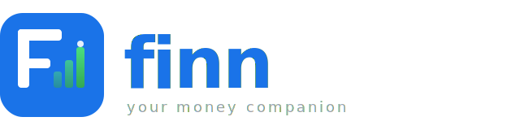

<p align="center">
  
</p>

# Finn 💎
[](https://github.com/sahiltha123/Finn/actions/workflows/ci.yml)
[](https://firebase.google.com/)
[](https://riverpod.dev/)

**Finn** is a polished, insights-driven personal finance companion designed to transform how individuals interact with their money. Beyond traditional expense tracking, Finn leverages reactive insights, predictive modeling, and system-level thinking to provide a calm, empowering financial experience.

Built with **Clean Architecture**, **Riverpod**, and **Firebase**, Finn is a demonstration of engineering maturity and product thinking—designed to prove production readiness at every layer.

---

## ✨ Strategic Product Enhancements

Finn separates itself from generic trackers through ten high-impact features that demonstrate technical depth and product empathy:

| Feature | Signal | Implemented |
| :--- | :--- | :---: |
| **📊 Financial Health Score** | System Design thinking—aggregating data into insight. | ✅ |
| **🔔 Predictive Spending Alerts** | Proactive features (not just reactive logic). | ✅ |
| **🧠 Smart Recurring Detection** | Pattern recognition + smart UX for automated logging. | ✅ |
| **💰 Personalized Onboarding** | Capturing monthly income to suggest the first savings goal. | ✅ |
| **🛡️ Biometric Lock** | Security-first mindset for sensitive financial data. | ✅ |
| **📄 Professional PDF Reports** | Data integrity and shareable accountability. | ✅ |
| **🏗️ CI/CD Pipeline** | Professional automation (tests, linting, build checks). | ✅ |
| **📈 Performance Monitoring** | Production monitoring (not just local development). | ✅ |
| **♿ Inclusive Design** | Accessibility-first approach with semantic auditing. | ✅ |
| **🧪 Automated Test Coverage** | Engineering maturity and logic validation. | ✅ |

---

## 🏛️ Architecture & Tech Stack

Finn is built on a foundation of **Clean Architecture** to ensure maintainability, testability, and scalability.

- **Presentation Layer**: Flutter (Material 3) + **Riverpod** for declarative state management.
- **Domain Layer**: Pure Dart logic, entities, and use cases (the "Magic" of the health score).
- **Data Layer**: Repository pattern with **Firebase Firestore** (offline persistence enabled).
- **Core Layer**: Dependency injection providers, custom theme extensions, and global utilities.

### 🔥 Key Technical Integrations
- **Authentication**: Firebase Auth (Email/Password + Google Sign-In).
- **State Management**: `flutter_riverpod` + `riverpod_generator`.
- **Navigation**: `go_router` for deep-linkable, nested routing.
- **Charts**: `fl_chart` for dynamic spending trends and donut breakdowns.
- **Reporting**: `pdf` + `printing` for professional document generation.
- **Animations**: `lottie` for premium micro-interactions.

---

## 🛠️ Engineering Maturity

### Automated Testing
Finn includes a suite of unit tests for core domain logic (use cases and entities) using `mocktail`.
```bash
flutter test
```

### Continuous Integration
A GitHub Actions workflow is active on every pull request, ensuring:
1. **Flutter Analyze**: Strict linting compliance.
2. **Flutter Test**: Logic validation before deployment.
3. **Build Stability**: Android/iOS compilation checks.

### Performance & Crashlytics
- **Firebase Performance**: Real-time tracing of high-latency Firestore operations.
- **Crashlytics**: Automated crash reporting and error capture for production stability.

---

## 🚀 Getting Started

### Prerequisites
- Flutter SDK (>= 3.10)
- Firebase Project configured for Android/iOS

### Installation
1.  **Clone the Repo**:
    ```bash
    git clone https://github.com/sahiltha123/Finn.git
    cd Finn
    ```

2.  **Dependencies**:
    ```bash
    flutter pub get
    ```

3.  **Firebase Config**:
    - Place `google-services.json` in `android/app/`.
    - Place `GoogleService-Info.plist` in `ios/Runner/`.

4.  **Run**:
    ```bash
    flutter run
    ```

---

## ♿ Accessibility & UX
Finn follows **Material 3** principles with a custom **Glassmorphism** design system.
- **Dark Mode**: Native support with high-contrast color tokens.
- **Semantics**: Every core chart, balance card, and transaction tile is audited for Screen Readers (TalkBack/VoiceOver).
- **Haptics**: Subtle tactile feedback for successful actions (saving goals, logging cash).

---

## ⚖️ License
This project is licensed under the MIT License - see the [LICENSE](LICENSE) file for details.

---

## 🏛️ Engineering Deep-Dive
For a comprehensive breakdown of the project’s design patterns, state management, and domain logic, see the **[ARCHITECTURE.md](./ARCHITECTURE.md)**.

---

> Built with 💎 and a "Product-First" mindset.
